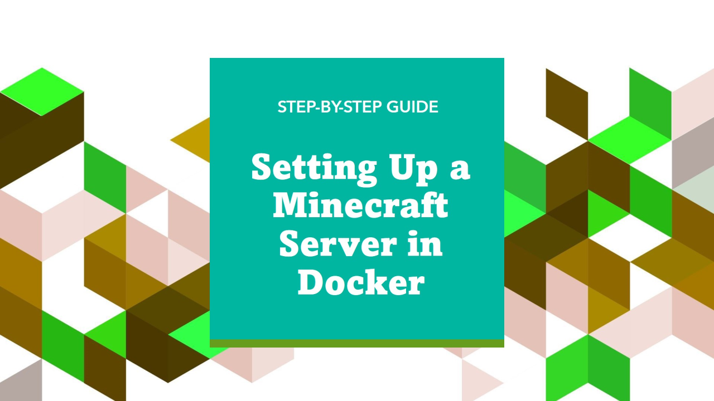

# Minecraft Forge Docker Server

This project is a Minecraft Forge Server that runs in a Docker container. The server is deployed on a remote server using an SSH tunnel. The project includes a deployment script that automates the deployment process.

## Requirements

- docker
- git
- tree
- zip
- autossh

## Installation

### Install Applications Required ( Ubuntu )

1.- **Install nrcon**

    ```bash
        cd /opt

        sudo apt-get update
        sudo apt-get install gcc 
        sudo apt-get install build-essential
        sudo apt-get install make

        git clone git clone https://github.com/Tiiffi/mcrcon.git

        cd /opt/mcrcon
        make
        sudo make install
    ```

### Install the Minecraft Server

1. **Create a new directory**

    ```bash
        sudo mkdir /var/www/minecraft-server

        sudo mkdir /var/www/minecraft-server/configurations
    ```

2. **Change the owner of the directory**
   
    ```bash
        sudo chown -R $USER:$USER /var/www/minecraft-server
    ```

3. **Clone the repository**
   
    ```bash
        cd /var/www/minecraft-server/configurations

        git clone git@github.com:luis122448/minecraft-server-bash.git
    ```

4. **Define the environment variables**

    First, define the IP address of the server for $SERVER_LOCAL_HOST variable:
    
    ```bash
        ip -4 addr show docker0 | grep -Po 'inet \K[\d.]+' 
    ```

    Then, define the environment variables in /etc/environment:

    ```bash
        sudo nano /etc/environment
    ```

    ```bash
        SERVER_LOCAL_HOST=
        SERVER_LOCAL_USER=
        SERVER_HOST=
        SERVER_USER=
        RCON_PASSWORD=
        MINECRAFT_SERVER_APP_PORT=
        MINECRAFT_SERVER_RCON_PORT=
    ```

    Charge the environment variables:

    ```bash
        source /etc/environment
    ```

    **Note:** The $SERVER_HOST and $SERVER_USER variables are used to access the server via SSH.

5. **Copy and Paste forge-installer.jar installer in the following directory**

    ```bash
        cp /path/to/forge-*.**.*-**.*.**-installer.jar ./server/forge-installer.jar
    ```

    **Note:** The forge.jar installer is used to install the Minecraft Forge Server. Check the version of the forge.jar installer in the official website: https://files.minecraftforge.net/

    **Important:** Rename forge installer to forge-installer.jar

6. **Copy and Paste your mods collection in the following directory**

    ```bash
        ./mods
    ```

    **Important:** The mods collection must match the version of the Minecraft Forge Server.

7. **Execute the installation script**
    
    ```bash
        bash install.sh *.**.*
    ```

    **Note:** The *.*.* version is the version of the Minecraft Forge Server.
    **Important:** This version must match the version of the forge-installer.jar installer.

## Local Development

1. **Execute the deployment script**
    
    ```bash
        bash deploy.sh
    ```

2. **Verify the deployment**
    
    ```bash
        sudo docker ps
    ```

3. **Access the Minecraft Server**
    
    ```bash
        mcrcon -H localhost -P 25575 -p $RCON_PASSWORD
    ```

## Server Development

1. **Copy and paste key.pem in the following directory**
    
    ```bash
        ./tunnel/key.pem
    ```

    **Note:** The key.pem file is used to access the server via SSH.

2. **Initialize the SSH tunnel**
    
    ```bash
        bash ./tunnel/start.sh
    ```

## Maintenance

1. **Backup the Minecraft Server**
    
    ```bash
        bash backup.sh
    ```

    **Note:** The backup is stored in the /var/www/minecraft-server/backups directory.
    **Important:** This process stops the Minecraft Server.

2. **Restore the Minecraft Server**
    
    ```bash
        bash restore.sh volume-DDMMYYYY-HHMMSS.zip
    ```

3. **Update mods collection**
    
    Update the mods collection in the /var/www/minecraft-server/configurations/mods directory.
    And execute the restart script.

    ```bash
        bash restart.sh
    ```

    **Note:** This proccess automatically generaction backup of the server.
    **Important:** This process stops the Minecraft Server.